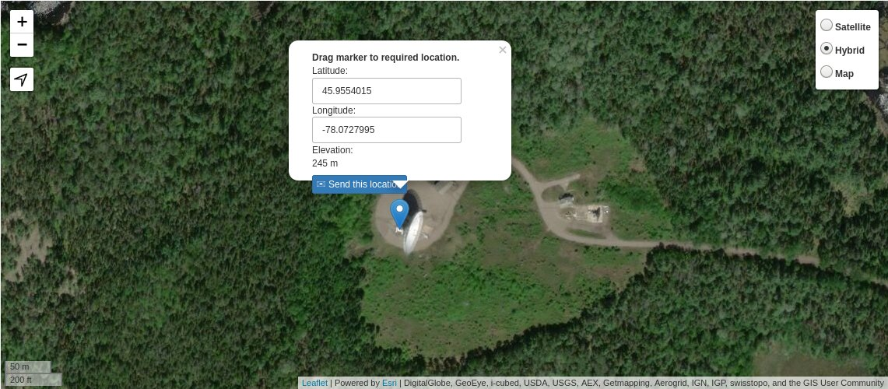

# Location and beam

## Antennas location

Source: [Maps.ie](https://www.maps.ie/coordinates.html)

|      | Latitute   | Longitude   | Elevation |
|------|------------|-------------|-----------|
| 10-m | 45.9555431 | -78.0701136 | 229-m     |
| 46-m | 45.9554015 | -78.0727995 | 245-m     |

## Distance calculator (online)

Source: [GPS-Coordinates](https://gps-coordinates.org/distance-between-coordinates.php)

Distance: 208-m

## Antenna pattern, First Run Simulations

So far I recreated the Clover Leaf antenna in FEKO with an antenna pattern that
matches the documentation of CHIME. Then coupled it to a 10-m F/0.35 dish.
The peak gain **on-axis is 32-dB**, moving off-axis it falls to **5-dB or lower
at 20-deg**.

The simulation assumes an ideal dish with the feed at perfect focus center.
Surface errors and slight unalignments can be 10 to 20% losses.

## Pending:
- Improve the model adding the ground plane behing the feed.
- Run simulation with feed misalignment.

