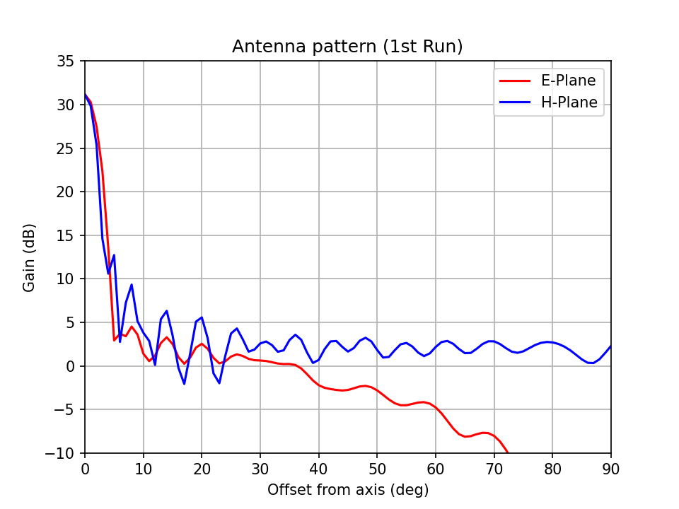

# Antenna pattern, First Run Simulations

So far I recreated the Clover Leaf antenna in FEKO with an
antenna pattern that matches the documentation of CHIME.
Then coupled it to a 10-m F/0.35 dish.

The peak gain **on-axis is 32-dB**, moving off-axis it falls to
**5-dB or lower at 20-deg**.

The simulation assumes an ideal dish with the feed at perfect
focus center.

Surface errors and misalignments can reduce gain by 10 to 20%.

