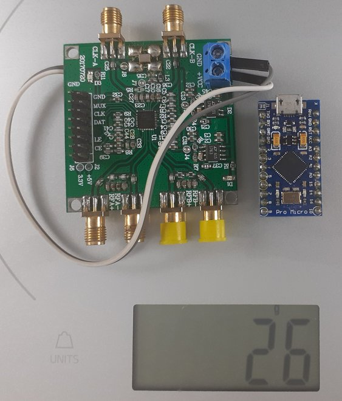
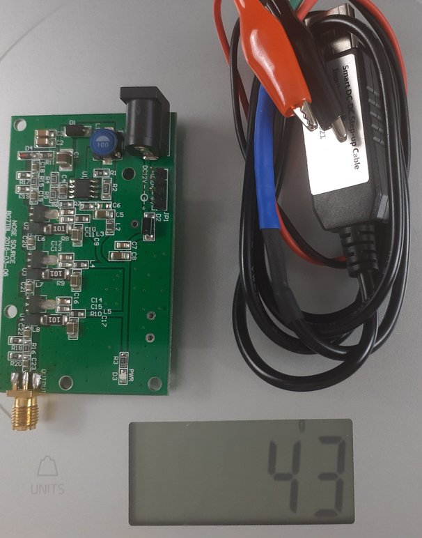
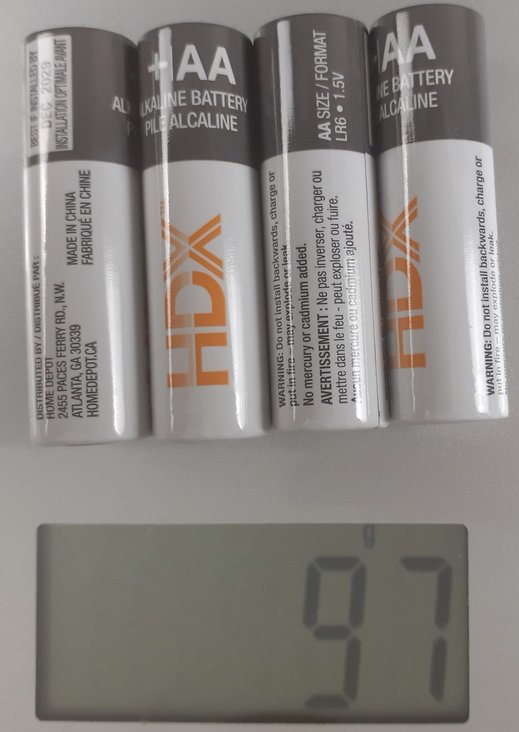

# Signal sources for calibration

1. Signal generator with Arduino control.
    * Easy to see it in on the data.
    * Can be automated to generate different frequencies.
    * Maybe it is not working anymore (need to find the
        code and test it.)

2. Noise source with step-up power converter.
    * Already working just put some tape or ziptires.
    * Higher power consumption.

3. Power supply.

    The quick and easy solution is use 4 AA batteries, but is
    heavy, maybe opening a cheap USB battery will be lighter
    after removing the external plastic.

