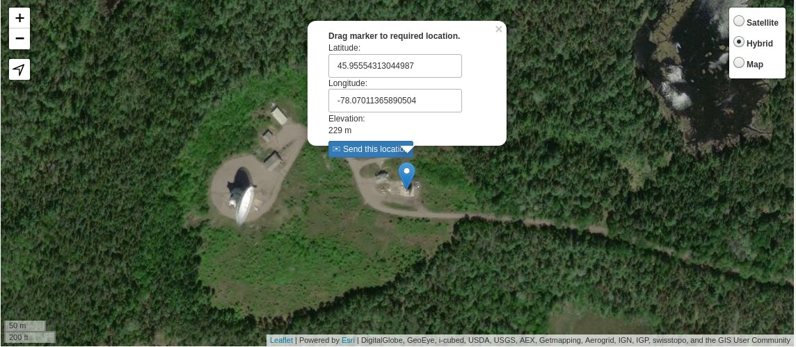
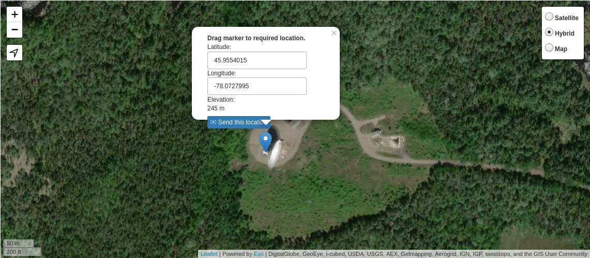

# Location and beam

## Antennas location

Source: [Maps.ie](https://www.maps.ie/coordinates.html)

|      | Latitute   | Longitude   | Elevation (m) |
|------|------------|-------------|---------------|
| 10-m | 45.9555431 | -78.0701136 | 229 m         |
| 46-m | 45.9554015 | -78.0727995 | 245 m         |

## Distance calculator (online)

Source: [GPS-Coordinates](https://gps-coordinates.org/distance-between-coordinates.php)

Distance: 208 m