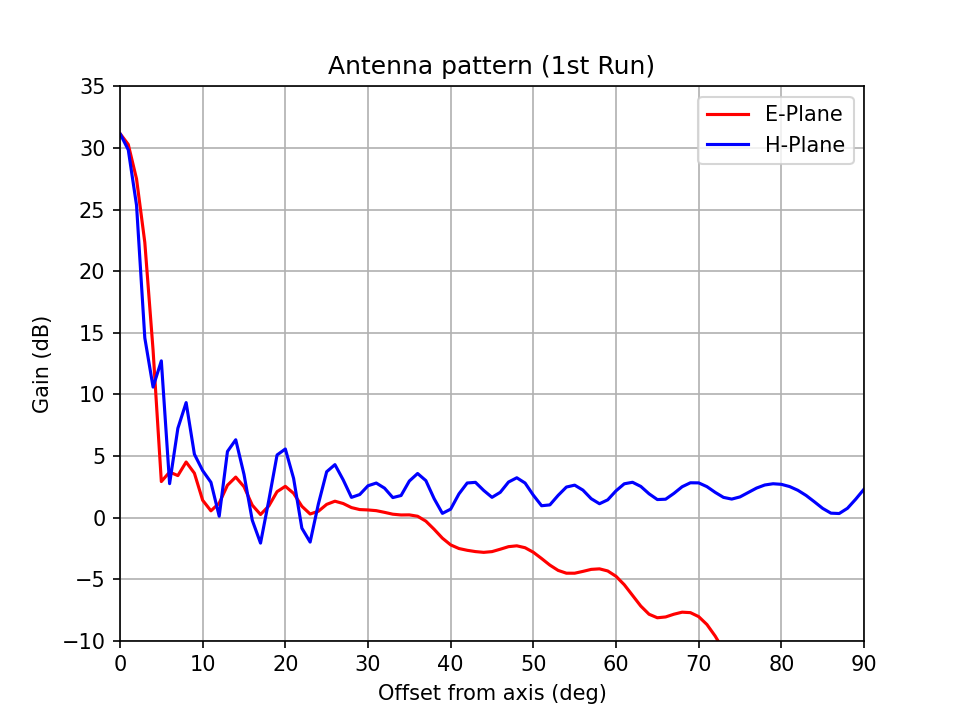

# Summary

## Location (20200502location.md)

|      | Latitute   | Longitude   | Elevation |
|------|------------|-------------|-----------|
| 10-m | 45.9555431 | -78.0701136 | 229-m     |
| 46-m | 45.9554015 | -78.0727995 | 245-m     |

**Separation: 208-m**

## Gain (20200502simulation.md)
The peak gain **on-axis is 32-dB**, moving off-axis it falls to **5-dB or lower at 20-deg**.

[First Simulation](20200502simulations.md)
